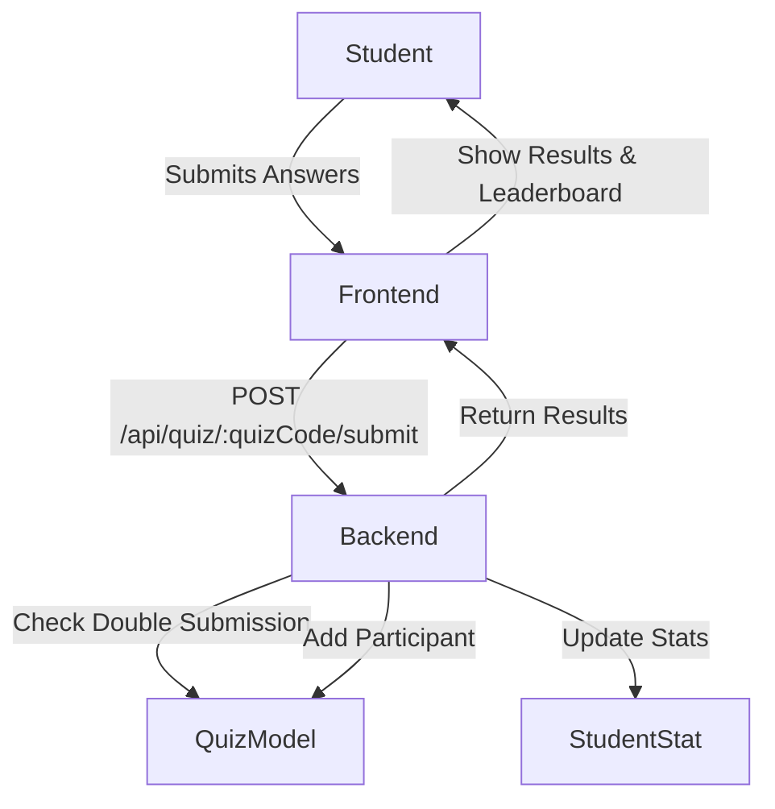

# Poll-automation Project: Complete Technical Overview

## Table of Contents
- [Project Overview](#project-overview)
- [Directory Structure](#directory-structure)
- [Backend Architecture](#backend-architecture)
  - [Tech Stack](#tech-stack)
  - [Main Models](#main-models)
  - [Routes & Services](#routes--services)
  - [Quiz/Meet/Stat Logic](#quizmeetstat-logic)
- [Frontend Architecture](#frontend-architecture)
  - [Tech Stack](#frontend-tech-stack)
  - [Main Pages & Components](#main-pages--components)
  - [Quiz Flow & Leaderboard](#quiz-flow--leaderboard)
- [Data Flow: End-to-End](#data-flow-end-to-end)
- [Debugging & Fixes (This Session)](#debugging--fixes-this-session)
- [Best Practices & Design Choices](#best-practices--design-choices)
- [Tips for Future Development](#tips-for-future-development)

---

## Project Overview

**Poll-automation** is a full-stack web application for managing and automating quizzes, meets, and student performance tracking. It supports:
- Admins creating quizzes and meets
- Students taking quizzes
- Real-time leaderboards
- Detailed student statistics and analytics

The project is organized into three main parts:
- **admin/**: Admin dashboard and tools
- **frontend/**: Student-facing quiz app
- **backend/**: Node.js/Express API and database logic

---

## Directory Structure

```
ddd/
  Poll-automation/
    admin/         # Admin dashboard (React)
    frontend/      # Student quiz app (React)
    backend/       # Node.js/Express API, MongoDB models
    README.md      # Project-level documentation
```

### Key Backend Folders
- `models/`: Mongoose schemas for Quiz, User, StudentStat, etc.
- `routes/`: Express route handlers for quizzes, meets, stats, auth
- `services/`: Business logic (e.g., quiz submission handler)
- `utils/`: Helper functions (e.g., stat updater)
- `scripts/`: Data seeding, debugging scripts

### Key Frontend Folders
- `src/pages/`: Main React pages (Quiz, Dashboard, Login, etc.)
- `src/components/`: UI components (Header, Layout, Leaderboard, etc.)
- `src/contexts/`: React context for auth, theme
- `src/utils/`: Axios config, helpers

---

## Backend Architecture

### Tech Stack
- **Node.js** with **Express** for REST API
- **MongoDB** with **Mongoose** for data modeling
- **JWT** and custom middleware for authentication

### Main Models
- **User**: Admins and students, with roles and permissions
- **Quiz**: Contains questions, participants, quiz code, status
- **StudentStat**: Aggregated stats for each student (quizzes taken, scores, accuracy, etc.)
- **Meet**: (For group events, similar to quizzes)

#### Example: Quiz Model (Simplified)
```js
{
  topic: String,
  questions: [ ... ],
  participants: [
    {
      user: ObjectId,
      score: Number,
      answers: [...],
      completedAt: Date,
      timeTaken: Number
    }
  ],
  quizCode: String,
  status: String
}
```

### Routes & Services
- **/api/quiz/**: Student quiz endpoints (get, submit, leaderboard)
- **/api/student-stats/**: Stats endpoints (get stats, leaderboard)
- **/api/admin/**: Admin quiz/meet management
- **/api/auth/**: Login, registration
- **services/quizSubmissionHandler.js**: Handles updating stats after quiz submission

### Quiz/Meet/Stat Logic
- When a student submits a quiz:
  1. Their answers are checked, score calculated
  2. A participant record is added to the quiz
  3. StudentStat is updated (quizzes taken, scores, accuracy, etc.)
  4. Leaderboard is updated and sorted by score/time

---

## Frontend Architecture

### Frontend Tech Stack
- **React** (with hooks and context)
- **Material-UI** for UI components
- **Axios** for API requests
- **React Router** for navigation

### Main Pages & Components
- **Quiz.jsx**: Main quiz-taking page for students
- **Dashboard.jsx**: Student dashboard with stats and available quizzes
- **Login.jsx**: Auth page
- **Leaderboard**: Real-time leaderboard display
- **Header, Layout, ThemeContext**: UI/UX and theming

### Quiz Flow & Leaderboard
- Student starts a quiz, answers questions one by one
- Timer and progress bar shown
- On completion, answers are submitted to backend
- Results and leaderboard are shown immediately
- Stats are fetched and displayed on dashboard

---

## Data Flow: End-to-End

### 1. **Quiz Creation (Admin)**
- Admin creates a quiz via the admin dashboard
- Quiz is saved in MongoDB with a unique code

### 2. **Student Takes Quiz**
- Student logs in, sees available quizzes
- Starts a quiz, answers questions
- Timer and UI feedback provided

### 3. **Quiz Submission**
- On completion, frontend sends answers and timeTaken to `/api/quiz/:quizCode/submit`
- Backend:
  - Checks for double submission
  - Adds participant to quiz
  - Calls `handleQuizSubmission` to update StudentStat
  - Returns results

### 4. **Stats & Leaderboard Update**
- StudentStat is updated (quizzes attempted, scores, accuracy, etc.)
- Leaderboard is recalculated and returned
- Student sees their performance and rank

---

## Debugging & Fixes (This Session)

### Issues Fixed
- **Double Submission:**
  - Used a React ref (`hasSubmittedRef`) to prevent multiple submissions from timer/last question
- **Stats Not Updating:**
  - Moved StudentStat update to backend quiz submission endpoint
- **Cleaner API:**
  - Now only one API call is needed for quiz submission and stats update
- **Leaderboard/Stats Consistency:**
  - Ensured leaderboard and stats always reflect latest submission

### Key Code Patterns
- **Backend lock:** Prevents duplicate participant records
- **Frontend lock:** Prevents duplicate API calls
- **Centralized stats update:** Always update stats server-side after quiz submit

---

## Best Practices & Design Choices
- **Single Source of Truth:** Stats and quiz data are always updated in the backend
- **Idempotent Endpoints:** Submitting a quiz twice is blocked
- **Separation of Concerns:** Admin, student, and backend logic are cleanly separated
- **Modern React:** Hooks, context, and functional components
- **Security:** Auth middleware on all sensitive routes

---

## Tips for Future Development
- **Add more analytics:** Track per-question stats, trends over time
- **Notifications:** Email or in-app notifications for quiz results
- **Admin analytics:** More detailed reporting for admins
- **Real-time features:** Use websockets for live leaderboard updates
- **Testing:** Add unit/integration tests for backend and frontend
- **Mobile support:** Responsive design or a mobile app

---

## Diagram: Quiz Submission Flow



---

# End of Project Explanation

This file gives you a deep, end-to-end understanding of your Poll-automation project, its architecture, and the improvements made. Use it as a reference for onboarding, debugging, or future development! 